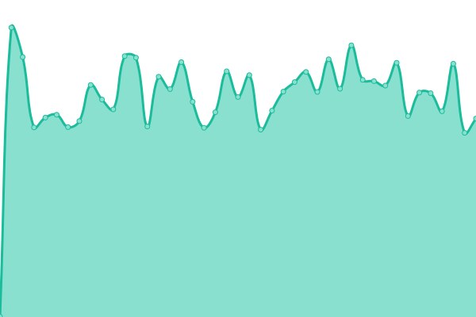
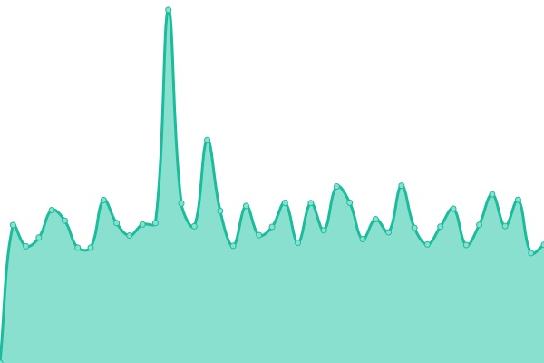
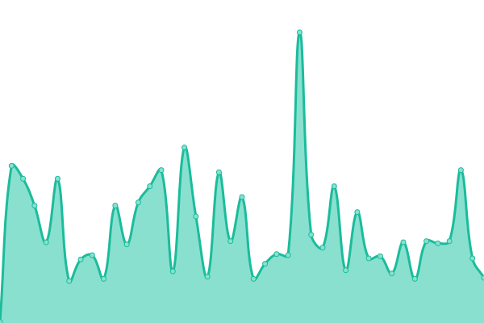

# [📈 Live Status](https://scottstreit.github.io/Uptime): <!--live status--> **🟩 All systems operational**

This repository contains the open-source uptime monitor and status page for [Scott Streit](https://scottstreit.github.io/Uptime), powered by [Upptime](https://github.com/upptime/upptime).

With [Upptime](https://upptime.js.org), you can get your own unlimited and free uptime monitor and status page, powered entirely by a GitHub repository. We use [Issues](https://github.com/scottstreit/Uptime/issues) as incident reports, [Actions](https://github.com/scottstreit/Uptime/actions) as uptime monitors, and [Pages](https://scottstreit.github.io/Uptime) for the status page.

<!--start: status pages-->
<!-- This summary is generated by Upptime (https://github.com/upptime/upptime) -->
<!-- Do not edit this manually, your changes will be overwritten -->
<!-- prettier-ignore -->
| URL | Status | History | Response Time | Uptime |
| --- | ------ | ------- | ------------- | ------ |
|  [YETI - US](https://www.yeti.com) | 🟩 Up | [yeti-us.yml](https://github.com/scottstreit/Uptime/commits/HEAD/history/yeti-us.yml) | 

 525ms
     
 | 

<a href="https://scottstreit.github.io/Uptime/history/yeti-us">100.00%</a>
    

|  [YETI - Canada](https://www.yeti.ca) | 🟩 Up | [yeti-canada.yml](https://github.com/scottstreit/Uptime/commits/HEAD/history/yeti-canada.yml) | 

 524ms
     
 | 

<a href="https://scottstreit.github.io/Uptime/history/yeti-canada">100.00%</a>
    

|  [Year In Preview](https://calendar.yeti.com) | 🟩 Up | [year-in-preview.yml](https://github.com/scottstreit/Uptime/commits/HEAD/history/year-in-preview.yml) | 

 104ms
     
 | 

<a href="https://scottstreit.github.io/Uptime/history/year-in-preview">100.00%</a>
    

<!--end: status pages-->

[**Visit our status website →**](https://scottstreit.github.io/Uptime)

## 📄 License

- Powered by: [Upptime](https://github.com/upptime/upptime)
- Code: [MIT](./LICENSE) © [Anand Chowdhary](https://anandchowdhary.com), supported by [Pabio](https://pabio.com)
- Data in the `./history` directory: [Open Database License](https://opendatacommons.org/licenses/odbl/1-0/)
